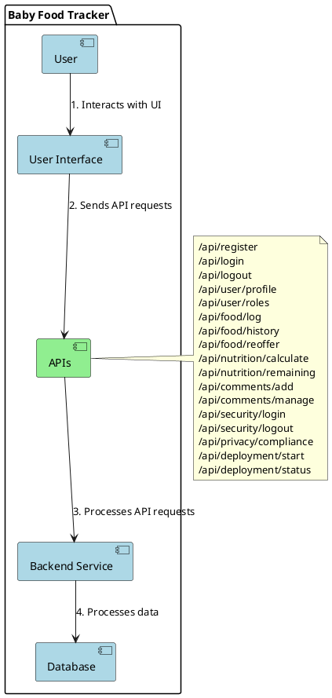

# NurtureTrack
# Baby Food Tracker Project

## Overview

The Baby Food Tracker is a web application designed to help parents track their child's food intake, monitor nutritional needs, and facilitate interaction through comments. This README provides an overview of the project's architecture, functionalities, and components.

## Architecture Diagram

### Components and Flows:
- **User:** Represents the end-user interacting with the application.
- **User Interface:** Frontend components where users interact (e.g., web interface, mobile app).
- **APIs:** Light green color to highlight the APIs component, serving as the interface between the User Interface and the Backend Service.
- **Backend Service:** Represents the backend logic and business operations of the application.
- **Database:** Stores application data such as user information, food logs, nutritional data, and comments.

## Project Description

The Baby Food Tracker application consists of several key features organized into epics and user stories:

### Epics and User Stories

1. **User Management**
   - User Registration
   - User Login
   - Role Management

2. **Food Logging**
   - Log Food Intake
   - View Food History
   - Re-offer Food

3. **Nutritional Tracking**
   - Calculate Nutrition Intake
   - Display Remaining Nutritional Needs

4. **Comments and Interaction**
   - Add Comments
   - Manage Comment Permissions

5. **Security and Privacy**
   - Secure Login
   - Data Privacy Compliance

6. **Deployment**
   - AWS Deployment

## API Endpoints

- `/api/register`: User registration endpoint.
- `/api/login`: User login endpoint.
- `/api/logout`: User logout endpoint.
- `/api/user/profile`: Endpoint to retrieve and update user profile information.
- `/api/user/roles`: Endpoint to manage user roles.
- `/api/food/log`: Endpoint to log food intake.
- `/api/food/history`: Endpoint to retrieve food intake history.
- `/api/food/reoffer`: Endpoint to mark and re-offer previously logged food items.
- `/api/nutrition/calculate`: Endpoint to calculate nutritional intake.
- `/api/nutrition/remaining`: Endpoint to calculate remaining nutritional needs.
- `/api/comments/add`: Endpoint to add comments to food logs.
- `/api/comments/manage`: Endpoint to manage comment permissions.
- `/api/security/login`: Secure login endpoint.
- `/api/security/logout`: Logout endpoint to invalidate user session.
- `/api/privacy/compliance`: Endpoint to manage data privacy compliance.
- `/api/deployment/start`: Endpoint to initiate deployment processes.
- `/api/deployment/status`: Endpoint to check deployment status.

## Getting Started

To run the Baby Food Tracker application locally:

1. Clone the repository.
2. Set up your development environment and dependencies.
3. Configure database settings and environment variables.
4. Build and run the application.

## Contributing

Contributions to the Baby Food Tracker project are welcome! Please fork the repository, make your changes, and submit a pull request. Be sure to follow the project's coding conventions and guidelines.

## License

This project is licensed under the MIT License - see the LICENSE file for details.

---

This README provides a structured overview of the Baby Food Tracker project, including its architecture, components, functionalities, and how to contribute to the project. Adjust the content as per your specific project details and requirements.
